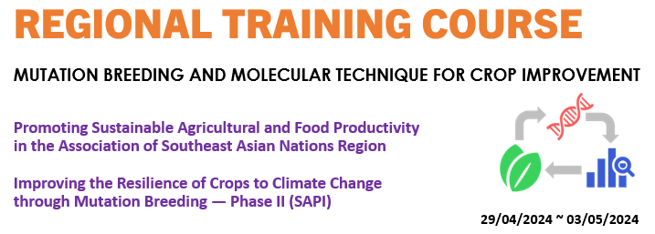

<a name="section1">Practice session in Regional training course</a>

In this practice part, we plan to use Google Colaboratory.

| No. | date | contents |
|:---|:---|:---|
| 01 | April 29th | [Introduction of Google Colab](https://colab.research.google.com/github/CropEvol/FAO_practice/blob/master/textbook/GoogleColab.ipynb)(Google Colab Notebook) |
| 02 | May 1st | [Mut-Map analysis](https://colab.research.google.com/github/CropEvol/FAO_practice/blob/master/textbook/MutMap.ipynb)(Google Colab Notebook) |
| 03 | May 1st | [QTL-seq analysis](https://colab.research.google.com/github/CropEvol/FAO_practice/blob/master/textbook/QTL-seq.ipynb)(Google Colab Notebook) |
| 04 | May 3rd | [Genomic Prediction](https://colab.research.google.com/github/CropEvol/FAO_practice/blob/master/textbook/GenomicPrediction.ipynb)(Google Colab Notebook) |

## Lecture slides
- [April 29th & 30th(1) slides](https://github.com/CropEvol/FAO_practice/blob/main/textbook/Apr_29_FAO_IAEA_training_slides.pdf)
- [April 30th(2) slides](https://github.com/CropEvol/FAO_practice/blob/main/textbook/Apr_30_DNA_sequencing.pdf)
- [May 1st slides](https://github.com/CropEvol/FAO_practice/blob/main/textbook/May_1_MutMap.pdf)
- [May 3rd slides](https://github.com/CropEvol/FAO_practice/blob/main/textbook/May_3_GenomicPrediction.pdf)

---
Copyright&copy; 2021 [Crop Evolution Lab., Kyoto Univ.](http://www.crop-evolution.kais.kyoto-u.ac.jp/) All rights reserved.
